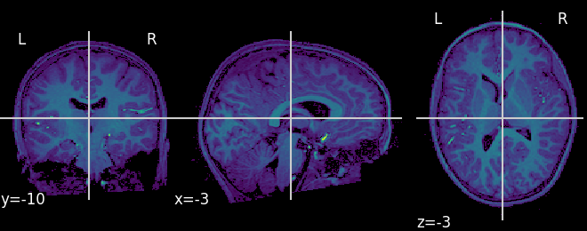
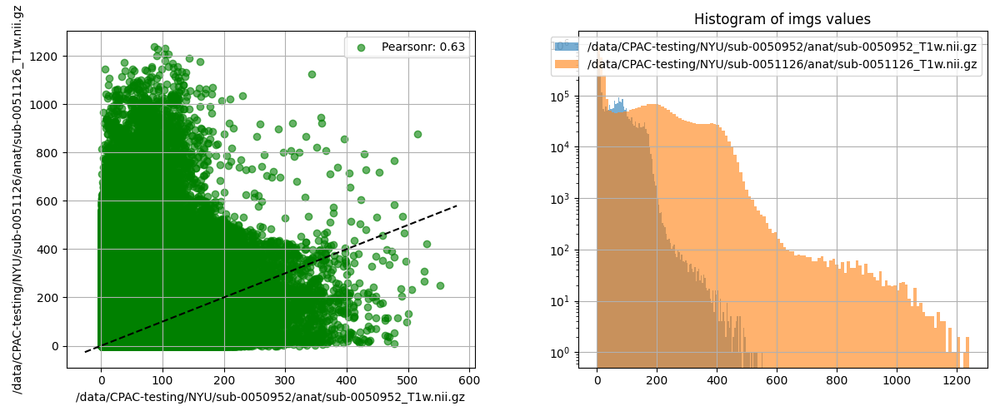

# Quick Viz Tools
Short-and-sweet cookie cutter visualization scripts or utilities, intended to lower the barrier for looking at all of our results, all of the time. Explore the table below of examples, or add yours following the [Contribution Instructions](#Contribution-Instructions), below. An important note is that these are not intended to be perfect or pollished, but to provide quick and easy to use utilities that help streamline our development and testing cycles. Don't be shy to add a new tool, or update one that is here to better suit your needs.

| Tool | Purpose | Relevant data | Example |
|------|---------|---------------|---------|
| [`plot_tsv_heatmap.py`](./code/plot_tsv_heatmap.py)  | Visualize TSV-stored matrices  | Connectomes, any numeric matrix |   |
| [`plot_nii_3dheatmap.py`](./code/plot_nii_3dheatmap.py)  | Visualize Nii-stored 3D brain data  | Structural Nii, Mean functional Nii, other 3D contrast |   |
| [`plot_nii_overlay.py`](./code/plot_nii_overlay.py)  | Compare placement/alignment of two images  | Structural Nii, Mean functional Nii, other 3D contrast |   |
| [`plot_nii_similarity.py`](./code/plot_nii_similarity.py)  | Compare signal distributions of two images  | Any two Nii images of the same shape |   |

## Usage Instructions
See a plot type you want to recreate or use in your own work? The path to adoption should be as follows:

1. Clone/Download this repository locally, so you have all of the files.
2. Look for the corresponding `resources/requirements/req*` file to describe what is needed for the tool to run. If it is a Python tool, you can likely satisfy all of these requirements by running `pip install -r {relevant_requirements_file}` inside of the Python environment of your choosing.
3. Look at the usage example at the top of the plot type you're interested in, to make sure you know how to provide the arguments.
4. Apply to your own data! Just replace the made-up paths and parameter values shown in the docstring with the real data paths relevant for your work.
5. Hit issues? Open a question here using the [issues](https://github.com/FCP-INDI/quick-viz/issues) tab, or patch the bug, as you wish.

## Contribution Instructions
Each time you encounter a new type of data that you need to look at, or new way you need to look at old data, ask yourself the question, "is there a possibility that I, or others, may need to do this again?" If the answer is yes, then consider adding it here. When adding a script/tool to this repository, we should try our best to adhere to the following guidelines:

1. Place your script/tool inside the `code/` folder. The code should:
   1. Be named according to the convention `plot_{file-extension}_{plot-type}.py` (or whatever programming language-specific extension is relevant). Note that for compound extensions, join values with a `-` instead of a `.`, to avoid confusion (e.g., a function operating on `dscalar.nii` data should be written as `plot_dscalar-nii_{plot_type}`). 
   2. Accept command-line arguments for input data and where the output should be saved.
   3. Provide brief descriptions of each parameter
   4. Include a usage example where the paths/values are provided to the script.

2. Place any necessary resources inside the `resources/` folder. If the resources are truly independently relevant for this new contribution, place them inside a similarly named folder (i.e., the folder name should match the name of the script, without the extension). Examples of resources include:
   1. Installation requirements file (Note: this should *always* be placed in `resources/requirements/req-{script_name}.txt`)
   2. Templates or parcellations
   3. Custom CSS

3. Provide an example of the visualization in the `examples/` folder, also following the same naving convention.

4. Add a description to this README, following the established format.

